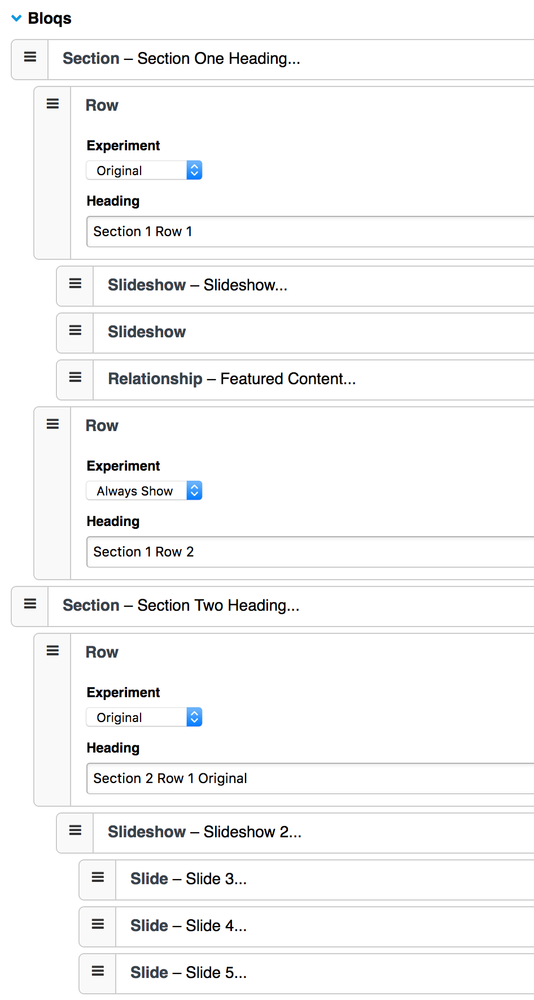

# Experiments 

## Parameters

    experiment_id
    query_parameter
    randomize
    choose
    prefix

### Content Tag Pair
   
    {exp:experiments:content choose="{experiment_field_name}"}
       {original}
           Original Content #1
       {/original}
    
       Always Shown
    
       {original}
           Original Content #2
       {/original}
    
       {variant}
           Variant Content #1
       {/variant}
    {/exp:experiments:content}

### Bloqs Tag Pair

Add an Experiments atom to your block and make it a block variable by prefixing the short name with `block_var` [See Bloqs documentation](https://eebloqs.com/documentation/nesting).
This field is designed to work with Bloqs' nestable mode, but will also work with nesting turned off. If you add it to a parent block all child blocks will be hidden or removed based
on the value chosen in the field, and which version of the experiment is being displayed to the end user.

The only updates you need to make to your template  is to wrap the main Bloqs field tag pair with the experiments plugin tag. That's it. Bloqs and the Experiment field will handle the rest.

    {exp:channel:entries channel="pages" entry_id="{segment_2}"}
          {exp:experiments:bloqs}
              {bloqs_field}
                  ... blocks ...
              {/bloqs_field}
          {/exp:experiments:bloqs}
     {/exp:channel:entries}
     

